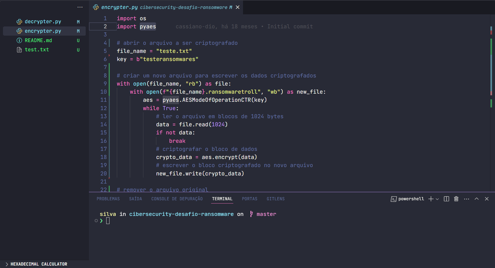

<h1 align="center">
    Desafio Cibersecurity Ransomware
</h1>

# Detalhe do projeto

Desafio cibersecurity ransomware realizar criptografar e descriptografar, utilizando a biblioteca pyaes

## Informação

<a href="https://github.com/SilvaneiMartins">
    
     
    
        <b>Silvanei de Almeida Martins</b>
    
</a>
     
 
🚀 Feito com ❤️ por Silvanei Martins